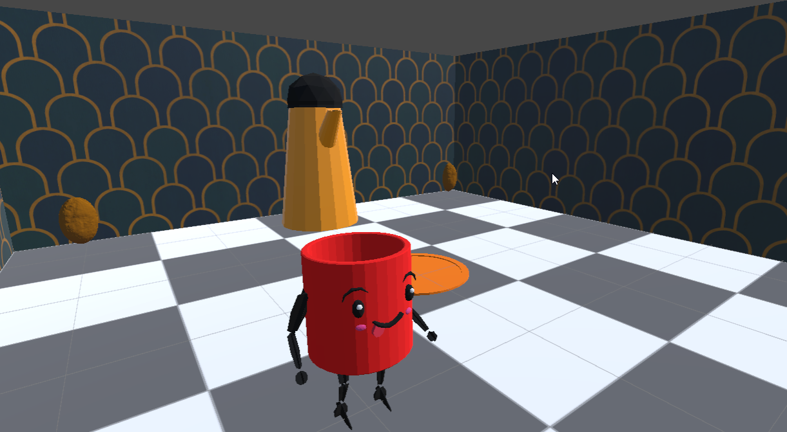

# Learn You A Game Jam 2024: Dark Fuel

## Learning Objective

For this game jam, my goal was to get my toes wet with 3D modeling and animation in Blender. Up to this point, I have
mostly avoided making 3D games due to my inability to produce 3D assets as well as the difficulty to find open source 3D
assets that feel like they work together. That said, I have found many very nice paid 3D assets and have acquired many
through Humble Bundle packages. However, as an educator, I try to keep all of my projects as free and open source as
possible so I can share them with the community and my students. Using paid resources prevents me from distributing and
creating content that can be used.

## The Result

Before we dive into the resources used and what was learned, let's take a look at the final result! Below is a 3D
Rendering showing the 3 main models I created for the entry: Dark Fuel (the main character), a kettle, and a coffee
bean!

With only about 20 hours of Blendering under my belt, I am still a novice with the tool BUT I feel confident that I can
make very simple 3D elements for future games. I hope I will continue to use Blender to create more 3D art.

## The Game

Presenting, Dark Fuel: Quest for the Golden Beans. The game is a 3D rendered platformer that with the camera locked into
a 2.5D isometric view.

The theme of the Jam was "Only One Inventory Slot" -- In this game, you control a coffee mug (Dark Fuel) who *IS* the
inventory slot. The main idea was to allow the player to "hold" different liquids that would modify the game play. Due
to limited time, I only managed to create two different abilities: Jumping Bean Coffee and Bolt Brew.

You can play the very short prototype here: [LINK](https://captaincoderorg.github.io/LearnYouAGameJam2024/)

## Resources Used

To learn the basics of blender, I used two GameDev.tv courses:
 
 * Blender Low Poly Characters: [LINK](https://www.gamedev.tv/courses/blender-low-poly-characters)
 * Blender Animation and Rigging: [LINK](Blender Animation & Rigging: Bring Your Creations To Life)

I acquired these, along with several other GameDev.tv courses via Humble Bundle. Both courses were very helpful and I
highly recommend them. That said, I'm sure there are some very useful free resources available.

## Learning the Hard Way

I find that I do not retain much when I follow a video tutorial. Throughout the courses listed above, I spent time away
from the videos working on my own creations. When stuck, I would perform web searches as well as ask others for help.
This can feel incredibly frustrating BUT I like to think that frustration and pain is where the actual learning happens.

I managed to push through the pain and finish a small number of models that I'm quite proud of.

